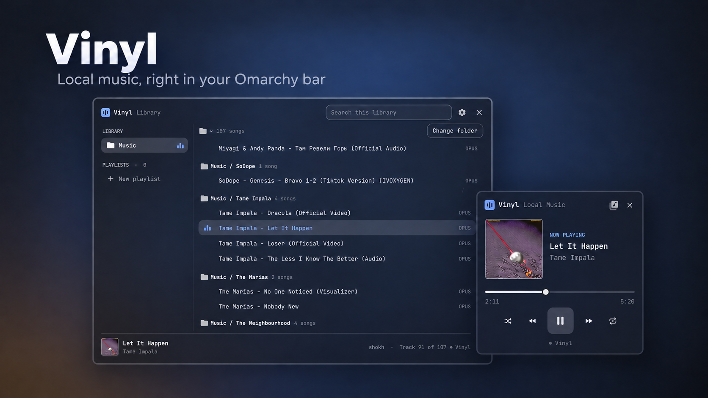

# Vinyl

A minimal local music player for the [Omarchy](https://omarchy.org/) bar.
Choose your music folder once, click a song, and it plays: no player window,
nothing to start by hand.



## Features

- **In the bar:** the song that's playing (artist and title, the title only,
  or the artist only) with a pause or play sign, or small Spectrum bars or
  Pulse Dots that follow the music.
- **Mini-player:** cover art, play/pause, previous, next, shuffle, repeat,
  and seeking.
- **Music Library:** every song in your folder in one list, search, and your
  own playlists.
- **Remembers where you stopped**, even after a restart.
- **First run sets itself up:** it installs anything missing, then asks for
  your music folder.
- Follows your Omarchy theme. Plays offline and never changes your files.

## Installation

**You need**

- Omarchy 4 or newer
- **mpv** and **mpv-mpris** (Omarchy includes them)
- **cava**, only for the Spectrum bar display

**Steps**

1. Install the packages. Any you already have are skipped:

   ```bash
   omarchy pkg add mpv mpv-mpris cava
   ```

2. Install Vinyl:

   ```bash
   omarchy plugin add https://github.com/shoxjaxon-atabayev/vinyl-local-music.git --enable
   ```

   Vinyl appears on the right of your bar.

3. Click Vinyl in the bar, then **Choose Music Folder**. Pick your music
   folder (for example `~/Music`) and click **Use this folder**.

4. Click a song. That's it.

If you skip step 1, Vinyl lists whatever is missing the first time you open
it, and installs it with one click in Omarchy's terminal.

## How to use

| Do this | To |
|---|---|
| Click Vinyl in the bar | Open the mini-player |
| Right-click Vinyl in the bar | Pause or resume |
| Click the library button in the mini-player | Open the Music Library |
| Click the cog in the Music Library | Choose the bar display |

---

## Bar display

Open the Music Library and click the **Settings** button (the cog next to
the close button). Choose how the bar shows what's playing:

| Mode | Shows |
|---|---|
| **Track Info** (default) | `Artist Name — Song Title`. The artist is shown in full; the title is shortened to 12 characters, ending in "…" when cut. A pause sign before it means the song is playing, a play sign that it is paused, as in Omarchy's media controls. |
| **Spectrum** | Twenty-four small bars, low to high frequencies, measured from the music. Needs **cava**. |
| **Pulse Dots** | Five dots whose size follows how loud the music is. |

With Track Info, choose what its text shows under **Track Info shows**:
**Artist — Title** (the default), **Title**, or **Artist**. A title that
starts with a copy of the artist, as files from video sites often have
("Tame Impala - Let It Happen"), is shown without it: "Let It Happen".

The choices apply at once and are kept after restarts. The bar is dimmed
while paused; hover it for the full title and artist. Spectrum and Pulse
Dots move only with real audio: while paused, or when there is no audio to
read, they rest flat. They read only your music player's own sound, never
other apps (see [Privacy](#privacy)).

## Using the Music Library

**Playing**

- Click a song to play it. The rest of the list plays after it (and
  **previous** goes back up the list), then playback stops. Clicking the
  song that is playing doesn't restart it.
- A song from a playlist plays only that playlist: from that song to the
  end, then from the beginning up to the song before it.
- Pause, turn the computer off, and the next day the song is waiting in the
  bar, paused at the same spot.
- Songs that were moved or deleted are marked as missing and skipped.
- Other local music players (such as MPD with mpDris2, or Strawberry) are
  shown in the bar and the mini-player while they play. Web browsers are
  ignored on purpose.

**Mouse**

- **Change folder** (next to the folder's path at the top) picks another
  music folder.
- Hover a track and click its **+** button to add it to a playlist.
- To add several tracks: **Ctrl-click** each one (this selects without
  playing; **Shift-click** selects a range), and choose **Add to playlist**.
- In a playlist, hover a track and click **−** to remove it, or use
  **Rename**, **Delete**, and **Play playlist** at the top.
- Click outside the window to close it.

**Keyboard**

| Key | Action |
|---|---|
| ↑ / ↓ | Move through the list |
| Enter | Play the song (in the folder chooser: open the folder) |
| Backspace | In the folder chooser: go up one folder |
| / | Search |
| Space | Select or unselect the track |
| Shift + ↑ / ↓ | Extend the selection |
| Ctrl + A | Select all tracks |
| Alt + ↑ / ↓ | Move a track up or down in a playlist |
| Delete | Remove the track from the playlist |
| Escape | Close a menu, clear the selection or search, or close the window |

Removing a track from a playlist never deletes the music file.

### A keyboard shortcut for the library

Add a line to `~/.config/hypr/bindings.lua` (pick a key combination that
isn't already in use — see `omarchy menu keybindings --print`):

```lua
o.bind("SUPER + SHIFT + M", "Music library", "omarchy-shell shell toggle community.shoxjaxon.vinyl")
```

## Configuration

- **Music folder:** choose it in the library (**Change folder**). It is saved
  with Vinyl's entry in `~/.config/omarchy/shell.json` as `libraryFolder`.
- **Bar display:** choose it in the library's **Settings**. It is saved in
  the same entry as `displayMode`: `trackInfo`, `spectrum`, or `pulseDots`.
  A missing or unknown value means Track Info. What Track Info shows is
  saved as `trackLabel`: `artistTitle` (the default), `title`, or `artist`.
- **Bar position:** Vinyl starts on the right. To move it, run
  `omarchy bar move community.shoxjaxon.vinyl --section <left|center|right>`.
- **Playlists** are saved in `~/.local/share/vinyl/playlists.json`
  (or `$XDG_DATA_HOME/vinyl/playlists.json`). The folder and file are
  private to your user. Limits: 100 playlists, 1,000 tracks per playlist,
  and 16 MB for the file.
- **Where you stopped** (the queue, the song, its position, shuffle and
  repeat) is saved in `session.json` in the same private folder: on every
  pause, seek, and song change, and every 5 seconds while playing. A queue
  holds up to 1,000 songs.
- The library lists up to 20,000 songs, 8 folder levels deep.
- Vinyl starts mpv itself, only while it has something to play, without a
  window and without your own mpv settings (`mpv.conf` doesn't affect it).

Supported audio files: mp3, flac, ogg, oga, opus, m4a, aac, wav, aif, aiff,
wv, ape, wma, and mka. Hidden files and folders are not shown. Links
(symlinks) inside your music folder are never followed, and Vinyl never reads
anything outside the folder you chose.

## Troubleshooting

**"Vinyl needs mpv to play music"**
mpv isn't installed. Click Vinyl in the bar and then **Install**, or run
`omarchy pkg add mpv mpv-mpris`, then click the song again.

**Install doesn't open a terminal, or says it didn't finish**
Vinyl runs `omarchy pkg add` in Omarchy's floating terminal
(`omarchy-launch-floating-terminal-with-presentation`). If the terminal
doesn't open within 20 seconds, or it closes before everything is
installed, the mini-player shows **Try Again**. You can also install the
packages yourself: `omarchy pkg add mpv mpv-mpris cava`.

**Media keys don't pause Vinyl**
They reach Vinyl through mpv-mpris: install it with
`omarchy pkg add mpv-mpris`. The bar's right click and the mini-player work
without it.

**"Playlists couldn't be read"**
The playlists file is damaged, larger than 16 MB, or from a newer version of
Vinyl. Vinyl doesn't change it. Click **Start fresh** and confirm to begin with
an empty list — your old file is kept next to it as
`playlists.json.bak-<date-time>`.

**"Playlists are read-only" or "can't be saved here"**
For safety, Vinyl only saves to a private folder and file. Fix the
permissions:

```bash
chmod 700 ~/.local/share/vinyl
chmod 600 ~/.local/share/vinyl/playlists.json
```

Vinyl also refuses to save if `~/.local/share/vinyl` or `playlists.json` is a
symbolic link.

**A track shows "Missing" or "Not in this library"**
The file was moved, renamed, or deleted, or it is outside the music folder
you chose. Missing tracks are skipped when playing; remove them from the
playlist or put the file back.

**No cover art**
Vinyl shows the cover embedded in the music file, or an image in the same
folder named `cover`, `front`, `Folder`, or `AlbumArt` (`.jpg`, `.png`, or
`.webp`; the names are case-sensitive). Covers reach Vinyl through
mpv-mpris: install it with `omarchy pkg add mpv-mpris`.

**Icons show as boxes**
Vinyl uses the icon glyphs of your Omarchy font. Omarchy installs a font with
these glyphs by default (JetBrainsMono Nerd Font); reinstall it if it was
removed.

**Vinyl doesn't appear in the bar**
Check that the plugin is enabled: `omarchy plugin list`. If it was added
without `--enable`, run `omarchy plugin enable community.shoxjaxon.vinyl`.
After an update, or if you edited the plugin's files by hand, restart the
shell: `omarchy-restart-shell`.

**Spectrum says it needs cava**
Install it with `omarchy pkg add cava`, then choose Spectrum again in the
library's Settings. Track Info and Pulse Dots don't need it.

**Spectrum or Pulse Dots stay flat while music plays**
They read the sound of your music player's own PipeWire stream. Hover Vinyl
in the bar: "No audio data" means that stream wasn't found — for example, the
player outputs audio without PipeWire, or its audio is turned off. The dots
and bars never move without real sound.

**The bar shows only a music note**
On a bar placed left or right there is no room for text or visualizations,
so Vinyl shows its music note in every mode.

## Updating and removing

Update to the latest version, then restart the shell so it loads the new
code (reloading plugins keeps the old version's code until a restart):

```bash
omarchy plugin update community.shoxjaxon.vinyl
omarchy-restart-shell
```

Remove Vinyl:

```bash
omarchy plugin remove community.shoxjaxon.vinyl
```

Your playlists and the saved session stay in `~/.local/share/vinyl/`.
Delete that folder if you don't need them anymore.

## Privacy

Vinyl needs no network access and sends nothing anywhere; its mpv plays
local files only (online streaming is turned off). It reads only your chosen
music folder and its own files, and writes only its playlists file, its
session file, a temporary queue file and mpv's control socket in your
private runtime folder (the queue file is emptied as soon as mpv has loaded
it), and its settings entry in `shell.json`. The one exception is the
setup's **Install** button: only when you click it, Omarchy's package
installer downloads the missing packages from the Arch repositories, and
Vinyl follows the install through a small marker file in your private
runtime folder, deleted when it's done.

With **Spectrum** or **Pulse Dots** selected, and only while music plays,
Vinyl also reads the sound level of your music player's own output — never
other applications, never your microphone. Pulse Dots reads it inside the
shell; Spectrum reads it through cava, using a small settings file in the
same private runtime folder. Nothing is recorded, stored, or sent. With
Track Info (the default), no audio is read at all.

## License

[MIT](LICENSE)
